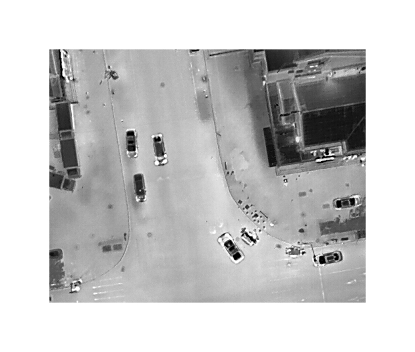
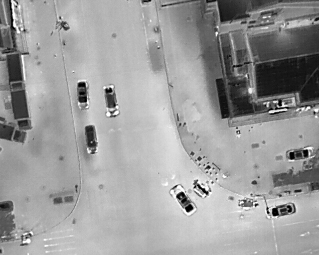

# DroneVehicle数据集处理方法


原始图像尺寸为840×712，四周设置了100个像素的白色边框，需要执行预处理操作以去除周围白色边框并将图像比例更改为640×512。

## 数据集下载

DroneVenicle数据集是由天津大学收集、标注的大型无人机航拍车辆数据集。  
训练集下载地址：<https://pan.baidu.com/s/1ptZCJ1mKYqFnMnsgqEyoGg> (node: ngar)  
验证集下载地址：<https://pan.baidu.com/s/1e6e9mESZecpME4IEdU8t3Q> (node: jnj6)  
测试集下载地址：<https://pan.baidu.com/s/1JlXO4jEUQgkR1Vco1hfKhg> (node: tqwc)  

## 数据集介绍

DroneVehicle 数据集由无人机采集的 56,878 张图像组成，其中一半是 RGB 图像，其余是红外图像。包含 5个类别：汽车(car)、卡车(truck)、公共汽车(bus)、厢式车(van)和货车(freight car)。

## 图片裁剪及标签转化

1. 裁剪图片  
源图大小840×712，裁剪图大小640×512，如图所示：  
  
  
对图片进行裁剪：

    ```python
    python img_crop.py
    ```

2. 标签转化  
将标签文件转换为yolo格式，需要将标签文件中的xmin、ymin、xmax、ymax转换为相对于图像宽高的比例。
此数据集用于目标检测任务，需要将标签文件转化为yolo格式：

    ```TEXT
    0 0.20390625 0.07421875 0.0421875 0.1171875
    ```

    运行xml2txt.py脚本，生成yolo格式的标签文件

    ```python
    python xml2txt.py
    ```

    ```python
    # 需要对部分错误标签进行了以下修改（可选）
    for obj in root.findall('object'):
            name = obj.find('name').text
            if name == 'feright car':
                name = 'feright_car'
            elif name == 'feright':
                name = 'feright_car'
            elif name == '*':
                name = 'feright_car'
            else:
                name = name
    ```

3. 配置文件
   将配置文件设置为如下格式：

    ```TEXT
    path: E:\python_pj\yolov8\YOLOv8-main\data\DroneVehicle_det
    train: E:\python_pj\yolov8\YOLOv8-main\data\DroneVehicle_det\images\train
    val: E:\python_pj\yolov8\YOLOv8-main\data\DroneVehicle_det\images\val
    test: E:\python_pj\yolov8\YOLOv8-main\data\DroneVehicle_det\images\test
    names:
        0: '机动车：'
        1: '机动车：'
        2: '机动车：'
        3: '机动车：'
        4: '机动车：'
    nc: 5

    ```

## 引用

>@ARTICLE{sun2020drone,
  title={Drone-based RGB-Infrared Cross-Modality Vehicle Detection via Uncertainty-Aware Learning}, 
  author={Sun, Yiming and Cao, Bing and Zhu, Pengfei and Hu, Qinghua},
  journal={IEEE Transactions on Circuits and Systems for Video Technology}, 
  year={2022},
  volume={},
  number={},
  pages={1-1},
  doi={10.1109/TCSVT.2022.3168279}
}
>
