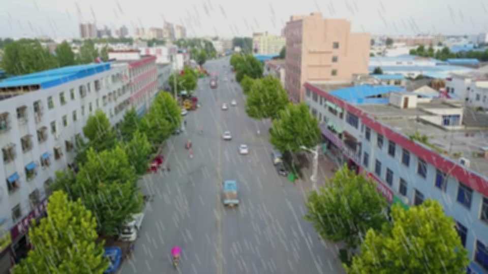

# DroneVehicle数据集处理方法


原始图像尺寸为840×712，四周设置了100个像素的白色边框，需要执行预处理操作以去除周围白色边框并将图像比例更改为640×512。

## 数据集下载

DroneVenicle数据集是由天津大学收集、标注的大型无人机航拍车辆数据集。
训练集下载地址：<https://pan.baidu.com/s/1ptZCJ1mKYqFnMnsgqEyoGg> (node: ngar)  
验证集下载地址：<https://pan.baidu.com/s/1e6e9mESZecpME4IEdU8t3Q> (node: jnj6)  
测试集下载地址：<https://pan.baidu.com/s/1JlXO4jEUQgkR1Vco1hfKhg> (node: tqwc)  

## 数据集介绍

DroneVehicle 数据集由无人机采集的 56,878 张图像组成，其中一半是 RGB 图像，其余是红外图像。包含 5个类别：汽车(car)、卡车(truck)、公共汽车(bus)、厢式车(van)和货车(freight car)。

## 图片裁剪及标签转化

1. 裁剪图片  
2. 标签转化  
3. 数据集划分  
4. 生成txt文件  
5. 生成yaml文件  
6. 修改配置文件  

😙
*斜体文本*  
**粗体文本**
***粗斜体文本***
~~删除线文本~~

- 项目一
- 项目二
- 项目三

1. 项目一
2. 项目二
3. 项目三

- [ ] 任务一
- [x] 任务二

[百度AA](https://www.baidu.com)
[百度DDDDDD][1]

[1]: https://www.baidu.com

```python
print('Hello World!')
```

| 表头1 | 表头2 | 表头3 | 表头4 |
| :--: | :--: | :--: | :--: |
| 内容1 | 内容2 | 内容3 | 内容4 |

> 这是一个引用块。
> 11111
> 11111111

-----------------------------

<!--  -->

  #静态badge图标
  #动态连接github仓库的图标
 #动态连接twitter账户的图标
 #采用社交图标
  #静态图标

